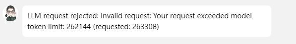

# OpenClaw 实战课程素材库

> 收集 OpenClaw 使用过程中的真实案例、错误排查、解决方案
> 用于课程开发和经验分享

---

## Token 超限错误案例

### 案例信息
- **记录时间**: 2026-02-13
- **来源**: 用户实际使用场景
- **分类**: 错误排查 / LLM 限制

### 错误现象
**错误信息**:
```
LLM request rejected: Invalid request: Your request exceeded model token limit: 
262144 (requested: 263308)
```

**截图**:


### 错误分析

| 项目 | 数值 |
|------|------|
| 模型 Token 上限 | 262,144 |
| 实际请求 Token | 263,308 |
| 超出 Token 数 | 1,164 |

**根本原因**: 
请求上下文（历史消息 + 系统提示 + 当前输入）累积超过了模型的最大 token 限制。

### 解决方案

#### OpenClaw 内置命令（推荐）

| 命令 | 作用 | 推荐度 |
|------|------|--------|
| `/compact` | 压缩会话上下文（摘要历史，减少 tokens） | ⭐ 先试这个 |
| `/new` 或 `/reset` | 完全重置会话（清空所有历史） | 如果 `/compact` 无效 |
| `/status` | 查看当前会话状态（模型 + tokens 使用情况） | 检查状态 |

#### 详细说明

**1. /compact - 智能压缩（首选）**
- 作用：将历史对话自动摘要，保留关键信息，大幅减少 token 占用
- 优点：不丢失上下文，对话可继续
- 适用：大部分 token 超限场景

**2. /new 或 /reset - 完全重置**
- 作用：开启全新会话，清空所有历史
- 优点：彻底解决问题，token 归零
- 缺点：丢失所有上下文，需要重新说明背景
- 适用：`/compact` 无效时的兜底方案

**3. /status - 状态检查**
- 作用：查看当前模型、token 使用情况、会话状态
- 用途：诊断问题、监控使用量

#### 其他优化策略

**中期优化** - 控制上下文窗口
- 定期总结对话要点，开启新话题
- 使用文件存储大段内容，而非直接粘贴
- 合理规划任务，拆分复杂请求

**长期策略** - 模型选型
- 了解不同模型的 token 限制
- 大上下文任务选择支持更长上下文的模型
- 考虑使用 Claude 3.5 Sonnet (200K) 或 GPT-4 Turbo (128K)

### 课程价值

**适合讲解的知识点**:
- Token 是什么？如何计算？
- 上下文窗口的工作原理
- OpenClaw 的会话管理机制
- 实际工作中的最佳实践

**学员常见问题**:
- Q: 为什么突然报这个错？之前还好好的
- A: 因为上下文是累积的，随着对话进行，token 数会不断增加

- Q: 怎么知道当前用了多少 token？
- A: 使用 `/status` 命令查看会话状态

### 相关链接
- OpenClaw 文档: https://docs.openclaw.ai
- Token 计算工具: https://platform.openai.com/tokenizer

---

## Token 管理最佳实践案例

### 案例信息
- **记录时间**: 2026-02-14
- **来源**: 用户实际配置经验
- **分类**: 配置优化 / Token 管理

### 背景
在配置 OpenClaw Token 管理机制时，发现配置值与实际 API 限制不符，需要校准。

### 关键发现

#### 模型上下文窗口校准

| 模型 | 配置值 | 实际 API 限制 | 状态 |
|------|--------|--------------|------|
| **Kimi K2.5** | 200,000 | **262,144 (256K)** | ❌ 需修正 |
| **GLM-5** | 200,000 | ~128K | ✅ 保守配置 |

**错误现象**:
```
LLM request rejected: Invalid request: 
Your request exceeded model token limit: 262144 (requested: 263308)
```

**根本原因**: OpenClaw 默认配置 200K 低于 Kimi K2.5 实际限制 256K，导致：
1. 网关层 compaction 过早触发（基于 200K 计算）
2. 实际请求超出模型限制时才报错

### 解决方案

#### 1. 更新模型配置

```bash
# 设置 Kimi K2.5 正确的上下文窗口
openclaw config patch --raw '{
  "models": {
    "providers": {
      "kimicode": {
        "models": [{
          "id": "kimi-k2.5",
          "contextWindow": 262144
        }]
      }
    }
  }
}'
```

#### 2. 配置网关层 Token 管理

```json
{
  "agents": {
    "defaults": {
      "compaction": {
        "mode": "safeguard",
        "reserveTokensFloor": 8192,
        "maxHistoryShare": 0.7,
        "memoryFlush": {
          "enabled": true,
          "softThresholdTokens": 235000,
          "prompt": "当前会话接近 Token 限制（256K），建议执行 /compact...",
          "systemPrompt": "⚠️ Token 预警：~230K/256K，建议及时压缩。"
        }
      }
    }
  }
}
```

**配置说明**:
- `softThresholdTokens`: 235,000 (~90% of 256K)
- `reserveTokensFloor`: 8,192 (保留给输出)
- `maxHistoryShare`: 0.7 (历史消息最多 70%)

#### 3. 设置定时提醒（Phase 2）

```bash
openclaw cron add \
  --name "Token检查-每20轮对话" \
  --cron "0 */4 * * *" \
  --tz "Asia/Shanghai" \
  --session isolated \
  --message "📊 Token 检查提醒：建议执行 /status 查看使用情况..." \
  --deliver \
  --channel qqbot \
  --to "用户ID"
```

### 三层防护体系

| 阶段 | 层级 | 实现方式 | 触发条件 |
|------|------|---------|---------|
| Phase 1 | 文档 | AGENTS.md 最佳实践 | 用户主动学习 |
| Phase 2 | 定时任务 | Cron 提醒 | 每 4 小时 |
| Phase 3 | 网关层 | compaction 自动预警 | Token ≥ 235K (~90%) |

### 多模型注意事项

**当前配置针对 Kimi K2.5 (256K) 优化**:
- 切换 GLM-5 (200K) 时，235K 阈值会超过其限制
- **切换前请执行 `/compact` 或临时调整阈值**

```bash
# 切换到 GLM-5 前
/compact

# 或临时调整为 180K (90% of 200K)
openclaw config patch --raw '{
  "agents": {
    "defaults": {
      "compaction": {
        "memoryFlush": {
          "softThresholdTokens": 180000
        }
      }
    }
  }
}'
```

### 课程价值

**适合讲解的知识点**:
- 不同模型的 Token 限制差异
- OpenClaw 配置与实际 API 的校准
- 三层防护体系设计思路
- 多模型环境下的配置管理

**学员常见问题**:
- Q: 为什么配置了 200K 还会超 256K 限制？
- A: OpenClaw 配置是预警阈值，实际请求仍可能超出模型硬限制

- Q: 如何为不同模型设置不同阈值？
- A: 当前需手动切换，或创建独立 agent 配置

### 相关文档
- `token-management-design.md` - 完整设计方案
- `token-management-phase1/2/3.md` - 三阶段实施记录
- `AGENTS.md` - Token 管理最佳实践

---

## 待添加案例

- [ ] SSH 密钥配置问题
- [ ] Git 连接 GitHub 配置
- [ ] Dashboard 远程访问配置
- [ ] MCP 工具配置经验

---

> **维护说明**: 每次遇到有价值的案例，及时记录到此文档
